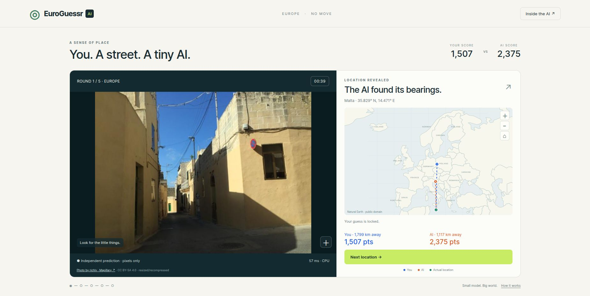
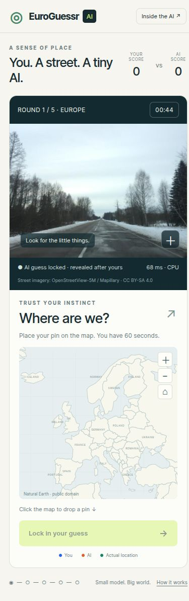
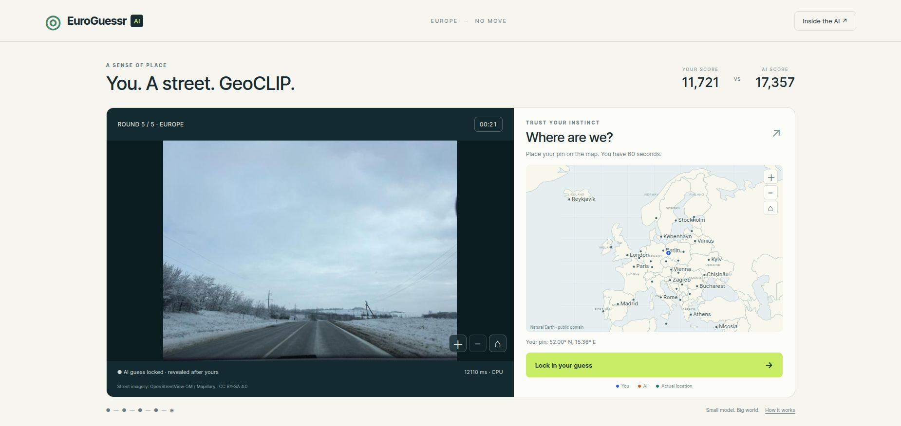
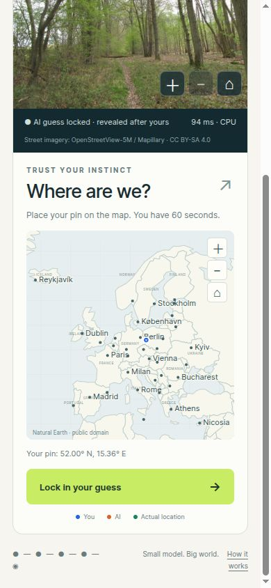
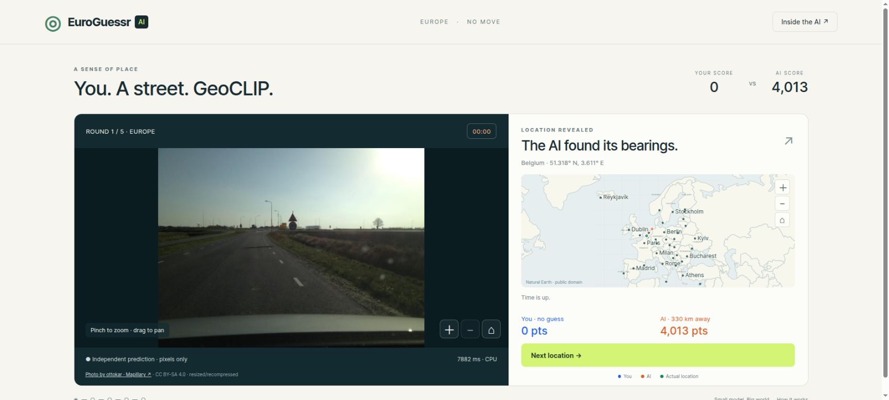

# Validation — 5 October 2026

## Automated checks

- Five Node tests: haversine distance/score, map projection/bounds, feature-only retrieval, geographic-head selection, and pixel normalization/interpolation.
- Pipeline check: train/validation/test IDs disjoint; train vs held-out sequences disjoint; geographic validation blocks disjoint; minimum train-to-holdout distance 25.256628 km; all 40 public images are attributed held-out images.
- PyTorch vs native ONNX maximum absolute error: 0.0000149012 after fine-tuning.
- Exported ONNX fixture reproduces its embedding/logits.
- Python vs JavaScript preprocessing fixture maximum absolute difference: 0.000000715256.
- Resume smoke check and publication/site-build results are recorded below after completion.

## Chrome computer-use checks

Used the user's Chrome browser through the computer-use agent, rather than substituting a headless browser.

- Model loads and runs on WASM CPU; a worker receives pixels only.
- Pointer map selection enables submit; keyboard Enter and arrow selection work.
- Submission reveals independent AI coordinates, actual position, distances, score, country and contributor link.
- Completed all five rounds; round totals and summary table agree.
- Real 60-second no-guess timeout reveals the answer and awards zero to the human.
- Actual `euroguessr-match.json` download exists and contains all five rounds, fixed game rules and model fingerprint. The browser tool's download notification timed out, but the downloaded file was verified on disk.
- Initial observed inference times in one smoke match: 107, 77, 75, 35, 45 ms. Earlier first prediction: 127 ms. Background training was active. These are not controlled benchmarks.
- `artifacts/chrome-desktop.jpg` preserves desktop evidence. Additional final mobile/published-route checks are appended below.

Synthetic smoke-test guesses are not evidence of human-level performance. No human research matches were collected.

## Final checks

- Resume smoke test copied the saved latest checkpoint into an isolated run and successfully completed epoch 10 with restored optimizer/RNG state.
- Cached distillation contract completed a one-epoch smoke run using explicitly synthetic teacher probabilities. This verifies student loss/cache plumbing only; real GeoCLIP teacher inference remains untested. The synthetic run was never exported or published.
- Mobile viewport 390 × 844: model loaded, map keyboard selection and scoring worked, and document width was 375 px with a 390 px viewport (no horizontal overflow). This is desktop Chrome responsive testing, not a physical phone latency measurement. `artifacts/chrome-mobile.jpg` preserves the full mobile layout.
- Final desktop model information correctly displays 1.09M parameters, 1,027/314/180 split counts, 863 km test median error, FP32 CPU inference and human win rate “Not measured.” Final desktop evidence: `artifacts/chrome-final-desktop.jpg`.
- Public asset synchronization passed: 353 registered runtime files across the repository.
- The first site-build minifier rejected top-level await; initialization was moved into an async function and retested.

- Full Jekyll build succeeded in 129.985 seconds. Compiled/minified JavaScript parsed successfully. Chrome loaded `/euroguessr/`, initialized the iframe’s model, performed a real 57 ms CPU prediction, and revealed correct score/distance fields. The existing compiled demo-list blog links to `/euroguessr/`.

## Saved evidence

Desktop screenshot photograph: Mapillary contributor **richlv**, image `164095439050762`, [original source](https://www.mapillary.com/app/?pKey=164095439050762&focus=photo), CC BY-SA 4.0. Screenshot is a resized rendering of the adapted game photograph.

Mobile screenshot photograph: Mapillary contributor **proxym**, image `133526505475291`, [original source](https://www.mapillary.com/app/?pKey=133526505475291&focus=photo), CC BY-SA 4.0. Screenshot is a resized rendering of the adapted game photograph.

## V2 research and UX checks — 5–6 October 2026

The sections above describe the preserved V1 implementation. V2 uses a real pinned GeoCLIP teacher in Docker, replacing the earlier synthetic-only distillation check. The complete comparison and continuation instructions are in [the measured report](artifacts/geoclip-overnight/REPORT.md) and [RESEARCH_V2.md](RESEARCH_V2.md).

- Eight Node tests pass: original scoring/projection/retrieval/preprocessing plus midpoint anchoring, clamping, pointer-count rebasing, cancellation and no accidental pinch guesses.
- Six Docker distillation contract checks pass, including partial coverage, cache checksum/resume identity, normalized projection, compatible encoder warm-start, grid/deadline contracts and zero-KL-gradient independence.
- Docker integration checks pass: uninterrupted two-epoch training agrees with one epoch plus optimizer/RNG resume within 1e-7, with exact RNG restoration; an expired deadline still creates resumable state and exports; frozen-to-two-tail-block fine-tuning changes the spatial weights and exported reference vectors agree with the complete CNN.
- Six differently shaped image fixtures compare the exact JavaScript CLIP bicubic resize/center crop with the pinned AutoProcessor; maximum absolute difference is 2.384e-7. JPEG decoder differences are a separate browser concern.
- Final research manifest has 8,500 train / 961 validation / 363 fresh test plus 180 legacy inspected test examples. Minimum new training-to-holdout distance is 25.002794 km. Validation/fresh-test holdouts also have a 25.015260 km minimum distance from V1's actual training IDs. No public game photograph enters training or fresh test.
- Both original V1 and all V2 candidate measurements use the identical new validation cohort. Fresh test remains separate from inference-method selection and deployment gating.

Chrome computer-agent testing uses the real Chrome browser through `cua_repl`. Source and compiled Jekyll routes have run real WASM CPU predictions. Tiny and the image-only 8-bit GeoCLIP have each completed five-round matches, with reveal pins, keyboard guesses, no-guess timeouts, totals and actual JSON downloads. Model switching replaces the worker to release the larger WASM heap; Tiny → GeoCLIP → Tiny was exercised in the UI.

The synthetic Pointer Event harness passed all ten checks at desktop size and at a **390×844** viewport: real worker ready, photo pinch/reset, map pinch, no guess with one remaining pointer, coordinate placement after arbitrary transforms, visible city tiers, inward clamping and no horizontal game overflow. Pointer capture is stubbed for synthetic IDs. These are desktop responsive/emulated touch checks; no physical phone has been tested. Evidence: [mobile gesture checks](docs/chrome-v2-mobile-gesture-checks.txt), [mobile screenshot](docs/chrome-v2-mobile-gesture-checks.png), and [desktop gesture checks](docs/chrome-v2-gesture-checks.txt).

The optional model is an explicit approximately 320 MiB download. It uses single-thread WASM and opportunistic SHA-verified caching. Observed early Chrome inference ranged from roughly 6–25 seconds under concurrent research load. These measurements do not establish phone performance. The initial Tiny smoke timings ranged from 80–346 ms. Final deployed-model evidence is recorded below.

The first compiled preview failed because plain nginx returned `.mjs` as `application/octet-stream`. The committed Docker preview config serves `.mjs` as JavaScript and `.wasm` as WebAssembly. Chrome then initialized both modes on `http://127.0.0.1:8800/euroguessr/`; production GitHub Pages already serves the vendor module as JavaScript. The first full V2 Docker Jekyll build succeeded in 246.91 seconds under concurrent teacher inference, including JavaScript minification.

Higher-resolution player imagery was recovered without upscaling: 40 photographs total **2,275,521 bytes**, with a highest available source long edge of **910 px**. Source and exported dimensions/checksums are preserved in `game-image-report.json` and `rounds.json`. City data contains 100 offline-ranked Natural Earth Populated Places records. Synthetic guesses and the inspected public photo pack are UI evidence only, not human evaluation or a fresh model benchmark.

## Quantization backend audit and repair

The first UINT8 dynamic-activation export passed native tests but failed the actual Chrome/native comparison. With identical saved Float32 tensors, native/WASM embedding cosine was approximately 0.9901–0.9906 and location differences were 91–320 km. Dequantizing only the patch convolution worsened parity (cosine 0.9803–0.9839; up to 1,564 km). Both variants were rejected for deployment. The precise kernel cause was not established; the observed activation quantization was also sensitive to one-ULP preprocessing changes.

The replacement retains per-channel UINT8 linear weights for storage, dequantizes them for ordinary FP32 matrix multiplication, and uses FP32 patch convolution and GeoCLIP MLP. Chrome successfully loaded it and ran two real WASM inputs. Native Docker comparison of those exact tensors found maximum embedding errors 2.76e-7 and 5.07e-7, with coordinate differences 0.00065 and 0.00498 km. The gameplay JPEG preprocessing was bit-exact against Pillow/AutoProcessor. Six independent shape fixtures likewise have zero Float32 error. This supports backend consistency for the checked inputs; it does not prove every JPEG decoder or physical phone behaves identically.

Evidence: `docs/geoclip-weight-only-parity.json`, `docs/chrome-v2-weight-only-audit.png`; rejected results are retained in the other `geoclip-*-parity.json` reports. Developer-only `tests/runtime-parity.html` downloads actual Chrome inputs and embeddings; `tests/runtime_parity.py` compares them in Docker and fails below cosine 0.9999. The harness and private research assets are excluded from publication. Direct-model checkpoint bundling preserves compressed actual audit downloads and exporter sources. Both native and browser ORT are version 1.23.2. Download size is 334,930,383 bytes before metadata sealing, approximately 320 MiB; resident execution memory is substantially larger.

The checkpoint comparison exports both the original head-best and last student snapshots using each snapshot’s own frozen-prefix scope, then selects by the actual deployment-method validation median. Original training checkpoints remain untouched. Both supervised and distilled controls receive this comparison before deployment/test locking. The integration test verifies that a last-checkpoint export’s references match the full CNN.

A repeat of the resume check under concurrent CPU load found a maximum parameter difference of 7.45e-9, identical epoch losses and geographic metrics, and identical PyTorch RNG state. The check now uses a strict 1e-7 absolute tolerance for parameters and optimizer moments, checks optimizer settings and the full training trajectory, and requires exact Python/NumPy/PyTorch RNG restoration. This distinguishes numerical reproducibility from guaranteed bitwise identity across separate CPU processes. Earlier bitwise-passing runs remain historical evidence.

The single embedding-only C ablation has zero KL weight. Six Docker distillation contracts now pass, including a new test that changes teacher soft geographic distributions and requires identical total loss and identical logits/projection gradients when KL weight is zero. Diagnostic raw KL values in C histories therefore do not indicate that its soft targets contributed to optimization. Evidence is in `docs/docker-distillation-contracts.txt`.

## Final Tiny source regression

The first promoted-Tiny five-round download failed the score/coordinate contract: keyboard movement in later rounds mutated earlier saved human coordinates through a shared object. The saved failure is `docs/chrome-v2-rejected-mutated-coordinates-match.json`. Guesses, keyboard coordinates and result snapshots now receive separate coordinate objects, and keyboard selection stops after reveal. A versioned application URL ensures Chrome loads the repaired gameplay code.

The corrected source route completed a new five-round match with different arrow-key directions and an attempted arrow move after reveal. Native Docker validation passed all five exported coordinate/distance/score contracts, model version and full prediction fingerprint. Maximum native/browser AI difference was **0.000734 km**; observed inference range **120–246 ms** under concurrent GeoCLIP test load. Evidence: `docs/chrome-v2-final-source-tiny-match.json`, `docs/chrome-v2-final-source-tiny-parity.json`, and the responsive result screenshot. This fixes gameplay bookkeeping; model inference bytes and the locked research configuration remain identical.

## Final deployed artifacts and compiled-route checks

Validation locked the deployment choice at **2026-10-05 23:15:02 UTC**, before fresh-test inference. Distilled B best.pt epoch 42 won: 724.05 km validation median against supervised A's 754.23 km and V1's 833.42 km. Fresh-test medians on the same 363 photographs are V1 **861.25 km**, A **807.32 km**, B **770.96 km**, embedding-only C **787.10 km**, and optional GeoCLIP **372.16 km**. No test result changed the selection. The full metrics, thresholds and controls are in the run report.

- Final Docker Jekyll build passed in **96.202 seconds**. The normal deployment's SLAM viewer was also built in Docker for the complete local site check. All **17 project routes**, 77 HTML dependencies and registered runtime files passed. Source/public/compiled model, shard, reference and metadata bytes agree with the sealed hashes. Final published files total **956,409,936 bytes** (912.10 MiB), below [GitHub Pages' 1 GB site limit](https://docs.github.com/en/pages/getting-started-with-github-pages/github-pages-limits). `docs/docker-final-jekyll-build.txt` preserves compiler output.
- Compiled `/euroguessr/` Tiny completed five rounds in Chrome at **390×844**. Actual match download and Docker verification passed all image-answer, manifest, version, prediction fingerprint, distance and score contracts. Median inference **95.5 ms**, range **74.1–198.4 ms**; maximum native/browser location difference **0.000727 km**. Evidence: `docs/chrome-v2-final-compiled-tiny-{match,parity}.json`.
- Compiled desktop Chrome at **1850×876** completed five rounds with the final GeoCLIP graph, shards and Europe gallery. The same native checks passed. Median inference **8411.2 ms**, range **7580.8–14536.3 ms**; maximum native/browser difference **0.010008 km**. Evidence: `docs/chrome-v2-final-compiled-geoclip-{match,parity}.json`. These timings are laptop observations, not controlled or physical-phone benchmarks.
- The compiled Tiny mobile gesture harness passed all ten checks. Evidence: `docs/chrome-v2-final-compiled-mobile-gesture-checks.{txt,png}`. Its temporary harness was copied only into the generated preview, then removed; it is excluded from publication. The mobile test tab was closed and temporary viewport controls reset.
- Tiny → GeoCLIP → Tiny replaced the worker and returned to a real **155 ms** Tiny prediction. A complete real 60-second no-guess timeout then showed zero human points and the independently computed AI score. The observed accessibility tree is saved in `docs/chrome-v2-final-compiled-timeout.txt`.
- Both immutable bundles were created and the student bundle was restored into a separate ignored run directory. All **six best/last checkpoints** preserved exact model tensors, optimizer tensors/settings, Python/NumPy/PyTorch RNG, history and configuration; only filesystem arguments were rebound. All three controls' saved inference assets remained byte-identical. Exact source-image checksums were verified for all 10,004 manifest entries. Evidence: `docs/docker-final-bundle-restore.txt`.
- The restored distilled optimizer/cache setup successfully handled an expired deadline without advancing training or replacing locked inference assets. All six checkpoints still passed exact restore verification; evaluating the restored selected predictor reused its original locked test report. Evidence: `docs/docker-final-resume.txt`.
- Final Docker pipeline passed leakage, public-photo attribution, real ONNX fixture, Python/JavaScript preprocessing and retrieval checks; minimum training/holdout distance **25.002794 km**. Final eight Node checks also passed in Docker. Evidence: `docs/docker-final-pipeline.txt`, `docs/docker-final-node-tests.txt`.

Screenshot photograph: Mapillary contributor **yakonovalov**, image `166969602295794`, [original source](https://www.mapillary.com/app/?pKey=166969602295794&focus=photo), CC BY-SA 4.0. The screenshot is a resized rendering of the adapted game photograph. Synthetic guesses demonstrate UI behavior and are not human research results.

Screenshot photograph: Mapillary contributor **sk53**, image `145507850807395`, [original source](https://www.mapillary.com/app/?pKey=145507850807395&focus=photo), CC BY-SA 4.0. The screenshot is a resized rendering of the adapted game photograph.

## Live release verification

Release commit `2839c720fc9653972c67ea2ccfd69bdd19929d01` and both baseline/release tags were pushed. [GitHub Pages build and deployment succeeded](https://github.com/LeoMaglanoc/LeoMaglanoc.github.io/actions/runs/37391136714). The published game is [leonardo-maglanoc.com/euroguessr/](https://leonardo-maglanoc.com/euroguessr/).

Both hosted metadata files are byte-identical to the validated release, both downloaded ONNX graph SHA-256 values match, and all five GeoCLIP shards and both reference packs return their expected byte counts. The hosted ORT module uses `text/javascript; charset=utf-8`. Evidence: `docs/live-deployment-proof.json`.

Fresh live-site Chrome testing initialized both hosted models and ran actual predictions: **149 ms Tiny** and **7882 ms GeoCLIP**. Tiny's reveal/scoring and information dialog displayed the selected distilled model, 8500/961/363 split, 724 km validation and 771 km test medians. GeoCLIP displayed the selected W8A32 version, 333/372 km medians and its explicit UINT8-storage/FP32-arithmetic description. Its real no-guess timeout displayed zero human points and an independent 4013-point AI result. These two live predictions are deployment smoke checks, not additional accuracy measurements. Screenshots are `docs/chrome-v2-live-{tiny,geoclip}.png` and their information-dialog companions.

Repository-wide CI is not entirely green. Formatting and public-site link-check failures also occurred at the preserved baseline. A full local formatting scan found **no warning among files changed by this release**. The unrelated [Drone browser check](https://github.com/LeoMaglanoc/LeoMaglanoc.github.io/actions/runs/37391137727/job/112036219783) failed at `projects/drone-racing/tests/browser.cjs:168`: expected reset yaw 0, observed 0.8447204968944099. No Drone files changed. That test's failure was inspected through Chrome; its cause was not established or modified in this EuroGuessr task. EuroGuessr's Docker, native/Chrome parity, checkpoint and Pages deployment checks passed.

## Balanced, untimed gameplay — 6 October 2026

The game now uses **79 photos across 39 countries**, all from the preserved legacy test cohort. The original 40 image files and model fixtures are unchanged. SHA-ordered additions provide at least two photos per represented country where available; Vatican City has only one legacy photo. Selection uses no model scores or fresh evaluation data. Added archive/export hashes and country counts are recorded in `docs/game-photo-balance.json`. The full pack totals 4,384,844 bytes and retains CC BY-SA attribution and source links.

Each match contains five distinct countries. Least-used-country selection, with random tie breaking, equalizes exposure across successive matches independently of each country's photo count. Each country's photos cycle without repetition before its own pool resets. History stays on the device under `euroguessr-balanced-v2`. Ten Docker Node tests passed, including 200 successive matches (1,000 round selections), distinct-country checks, exposure difference at most one, per-country photo cycles and stale-history sanitation. `docs/docker-gameplay-node-tests.txt` records the run.

All countdown/deadline logic has been removed. A real Chrome round remained playable without a guess for **68.075 seconds**, with no reveal and no timer element. Exports retain schema version 1 but declare `rules.seconds: null` and `photoSelection: country-balanced-v2`; round records retain `timedOut: false` for compatibility. The benchmark accepts historical timed matches separately and rejects mixed timing or sampling protocols. Docker checks accepted each protocol independently and rejected their mixture. This UI match uses synthetic keyboard guesses, not evidence about human performance.

Marker circles, letters and geographic centers now update on every map zoom/pan and viewport resize, using the SVG screen transform to convert a **20 CSS-pixel circle diameter** to map units. Final compiled Chrome measurements at overview and 8× zoom kept player, AI and actual-location circles within 0.001 px of 20 px. At mobile viewport 390 × 844, all three circles remained 20 px before/after zoom; body client/scroll widths were both 375 px (no horizontal overflow). Evidence: `docs/chrome-untimed-marker-checks.json`, `docs/chrome-untimed-desktop.png`, `docs/chrome-untimed-mobile.png`. Temporary viewport overrides were reset.

A complete actual Chrome untimed match exported five different countries (NL, DK, IS, LU, CH) and passed native Docker model/score verification: maximum native/browser coordinate difference **0.000664 km**. Evidence: `docs/chrome-untimed-match.json`, `docs/chrome-untimed-match-parity.json`. The final Docker Jekyll build passed in **105.245 seconds**; registered runtime assets synchronized successfully (407 files). Docker pipeline verification passed the real ONNX fixture, preprocessing and training/holdout leakage checks for all 79 public photos. The new exporter was rerun successfully without changing the photo pack or losing provenance. Model, retrieval assets, immutable checkpoint bundles and locked research measurements remain unchanged. HTML, stylesheet, app and photo-manifest URLs are versioned so browser caches pick up the changed rules and imagery.

Reproduce the photo expansion with `docker compose -f projects/euroguessr/compose.yaml run --rm --no-deps research python training/balance_game_images.py`; run Node checks with `docker compose -f projects/euroguessr/compose.yaml run --rm --no-deps research sh -c 'node --test tests/*.test.mjs'`. Revert the gameplay commit and republish registered assets to restore the prior timed game; no training or checkpoint restore is required.

Screenshot photograph: Mapillary contributor **ottokar**, image `1124709584691906`, [original source](https://www.mapillary.com/app/?pKey=1124709584691906&focus=photo), CC BY-SA 4.0. The screenshot is a resized rendering of the adapted game photograph.

The live Tiny screenshot uses Mapillary contributor **blazeburovski**, image `127068623545977`, [original source](https://www.mapillary.com/app/?pKey=127068623545977&focus=photo), CC BY-SA 4.0; it likewise renders the adapted photograph.
