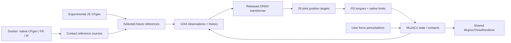

# G1 Loco-Manipulation — OmniContact in browser physics

Live demo: https://leomaglanoc.github.io/loco-manipulation/

Deploys OmniContact's released **29-joint transformer**, unchanged, in MuJoCo
3.11.0 WebAssembly. Carry & Place and Push Box share one pretrained policy.
This website performs no training, distillation or fine-tuning.

Select a skill and course, then **Start**. **Pause/Resume** preserves the task;
**Reset** restores its initial state. Drag to orbit; scroll or pinch to zoom.
**Push robot** applies 65 N laterally for 0.18 simulated seconds; **Push box**
applies 25 N. Forces act through MuJoCo's `xfrc_applied`, with no pose correction.
Tasks pause at their native reference endpoint. Start begins a fresh task.

Three courses change the initial and destination coordinates: diagonal
`(1, 0) → (2, 0.5)`, straight `(1, 0) → (2, 0)` and offset
`(1.2, -0.2) → (2, -0.2)`, in metres. Their contact-flow references are generated
by the newer **native CFgen** planner with its FK/IK routine, offline in Docker.
They are desired tracking references, not recorded robot states or animations.
Every displayed robot/box pose comes from live physics and policy feedback.

Expanding **Custom box & destination** allows other coordinates. Editing them
selects the older JavaScript reference planner from the released browser viewer.
This mode is explicitly experimental: grasping and goal completion are less
reliable. The native planner has not been completely ported to JavaScript.
The supported courses avoid silently replacing its IK with a simplified planner.

## Reproduce with Docker

From the repository root:

```bash
bash projects/g1-loco-manipulation/tools/fetch-upstream.sh
docker compose -f projects/g1-loco-manipulation/compose.yaml build research
docker compose -f projects/g1-loco-manipulation/compose.yaml run --rm research python projects/g1-loco-manipulation/tools/prepare.py
docker compose -f projects/g1-loco-manipulation/compose.yaml run --rm research python projects/g1-loco-manipulation/tools/visuals.py
docker compose -f projects/g1-loco-manipulation/compose.yaml run --rm research python projects/g1-loco-manipulation/tools/native.py
docker compose -f projects/g1-loco-manipulation/compose.yaml run --rm research python projects/g1-loco-manipulation/tools/references.py
docker compose -f projects/g1-loco-manipulation/compose.yaml run --rm research python projects/g1-loco-manipulation/tools/golden.py
docker compose -f projects/g1-loco-manipulation/compose.yaml run --rm research python scripts/publish-project-assets.py
docker compose -f projects/g1-loco-manipulation/compose.yaml up -d preview
```

Open `http://127.0.0.1:8094/assets/interactive/g1-loco-manipulation/` in Chrome.
Open `http://127.0.0.1:8094/tests/g1-loco-manipulation/` and press
**Run parity & task checks**. The test page uses source fixtures, so it requires
this repository preview; the public website excludes `projects/` and `tests/`.
The demo itself checks four frozen native inference vectors at startup and
stops visibly if maximum action error exceeds `2e-4`.

The Docker image pins its Python base by digest and Python packages in
`requirements.lock`. `fetch-upstream.sh` checks out immutable upstream revisions
under ignored `artifacts/upstream/`. Browser inference uses existing local site
ORT modules and WASM, one thread, CPU only; no CDN policy, WebGPU or Python server
is required by the deployed demo. Assets publish byte-for-byte through
`scripts/project-assets.json`; use the publisher's `--check` mode before commits.

To reproduce the unmodified multi-point CCD baseline separately:

```bash
docker compose -f projects/g1-loco-manipulation/compose.yaml run --rm -e LOCO_UPSTREAM=1 research python projects/g1-loco-manipulation/tools/native.py
```

That writes `results/native-upstream.json` without replacing the browser fixtures.
The normal native run uses the same single-point CCD configuration as the browser.
`tools/physics.py`, `tools/model.py` and `tools/first-step.py` are optional
physics diagnostics. They do not generate or alter policy weights.

## Architecture



`src/simulation.js` owns physics, policy, joint/actuator mappings and lifecycle.
One 50 Hz policy update is awaited, followed by four 5 ms physics steps. There
is no concurrent inference, skipped control tick or accumulating catch-up queue.
Rendering runs independently. Slow devices reduce simulation pace; displayed
pace measures simulated time against actual elapsed wall time, including timer
throttling. Pause/reset/task switching wait for an in-flight control boundary.
One physical model and a separate FK data buffer exist at a time; old models,
GPU resources and policy tensors are disposed.

Robot observations use fresh MuJoCo kinematics from current `qpos`, matching
native CFtrack's FK, without advancing the physics or changing solver state.
The object sensor uses the last body pose from `mj_step`, matching the native
runner. Rendering uses the shared `assets/interactive/shared/mujoco-three-renderer.js`
unchanged; this project has a small scene/camera wrapper, not another renderer.
The existing 12-action G1 walking controller is not reused for manipulation.

Canonical source lives in this project. Published copies live in
`assets/interactive/g1-loco-manipulation/`. `robots/` contains the original
physical geometry and separate simplified visual meshes. `results/` contains
native evaluations, failed experiments, browser reports and viewport screenshots.
`../../tests/g1-loco-manipulation/` contains the browser regression harness.
`../../_pages/loco-manipulation.md` and its dedicated layout provide the route.

## Exact policy contract

- `obs`: float32 `[1, 1244]` = **539 future-reference features** +
  **705 proprioceptive/history features**.
- `time_step`: float32 `[1, 1]`, zero for every inference. History is explicit;
  there is no recurrent state tensor to reset.
- `actions`: float32 `[1, 29]`, in the release's Isaac Lab joint order.

Future references use offsets `[0, 1, 2, 3, 4, 8, 12, 16, 24, 32, 50]` at 50 Hz.
Each contributes five poses (left/right wrists, torso, left/right ankles):
3D position plus 6D rotation, expressed relative to current torso heading.
The 495 pose values are followed by 44 contact flags (left/right foot,
left/right hand). References clamp to their final frame at the trajectory end.

Each 141-feature history frame contains, in order: five end-effector positions
in torso coordinates (15), root angular velocity (3), gravity orientation (3),
29 default-relative joint positions, 29 joint velocities, 29 previous actions,
object-relative position (3), object 6D orientation (6), and eight box corners
in heading coordinates (24). Relative object/corner vectors use the release's
norm clipping. Five frames are flattened **by feature group**, oldest first
within each group, not as five contiguous 141-value rows. Reset zeros history
and previous actions.

`config.json` records joint names, `mj2lab`/`lab2mj`, default angles, action scales,
PD gains and torque limits. For MuJoCo joint `i`, target angle is
`actions[lab2mj[i]] * action_scale_lab[lab2mj[i]] + default_angles_lab[lab2mj[i]]`.
Torques are `kp[i]*(target-q) - kd[i]*dq`, clipped to the released limits.
Angles use radians, positions metres, time seconds and quaternions **wxyz**.
Actuators are resolved from their joint transmission IDs, not assumed offsets.

## Policy and training provenance

- Native runtime/policy: [Ingrid789/OmniContact_sim2sim](https://github.com/Ingrid789/OmniContact_sim2sim),
  commit `1cf9ddd4067cbe5710b1f475e96f9c69f88055e2`.
- Browser planner/observation implementation:
  [OmniContact/omnicontact.github.io](https://github.com/OmniContact/omnicontact.github.io),
  commit `8daf3d331eff1952555f95b7c044049f61d0dd39`.
- Deployed checkpoint: `omnicontact_transformer.onnx`, SHA-256
  `d75742b86696d017b63bc4bb9d4f71599e22aeaea5fa21bdde81325813576c56`.
  `provenance.json` also records the evaluated MLP checkpoint hash.

The native release describes **CFgen** as generating contact-flow references
and **CFtrack** as the tracking policy. Its README links the
[Isaac Lab training implementation](https://github.com/Ingrid789/OmniContact),
[research project](https://omnicontact.github.io/),
[paper](https://arxiv.org/abs/2606.26201) and
[OmniContact dataset](https://huggingface.co/datasets/lightcone02/OmniContact-Dataset).
These are upstream provenance, not experiments performed here. This integration
reproduces released CPU execution and validates the exported actor; it does not
reconstruct the exact training run, training seed, dataset split, optimizer
schedule or checkpoint-selection history. Those details are not independently
verified for this specific ONNX file. Website tests are not evidence of the
paper's reported success rates or real robot performance.

## Physics and validation

MuJoCo native and browser versions are **3.11.0**. Carry uses a free 30 cm,
2 kg cube and two physical platforms. Push uses the native caster scene:
8 kg main body plus four caster assemblies, 46 × 50 × 52 cm box envelope.
Original inertias, collision meshes, friction, joint ranges and motor limits
are retained. Physics dt is 5 ms (the native runner's override), with
`implicitfast` integration. Ghost/reference bodies are removed. Visual-only
meshes use at most 2,500 faces; collision meshes are not simplified.

**Intentional solver change:** multi-point CCD is disabled in both builds.
With the default multi-point setting, one wrist/forearm contact point differed
by approximately 2.7 mm across native/WASM builds and produced a `0.001836`
maximum qpos difference over the frozen control intervals. All compiled masses,
inertias, geometry and convex hull graphs matched. Single-point CCD retains
physical collisions and friction, and passes the original `2e-4` physics
threshold; it does not attach the box or stabilize the robot artificially.
`results/native-upstream.json` preserves the original solver baseline.

The browser harness checks ten frozen native observation/action frames per skill,
raw inference independently, and nine four-substep physics intervals per skill.
Observation tolerance is `2e-5`, action tolerance `2e-4`, physics qpos tolerance
`2e-4`. It then executes all six live course rollouts, requiring planar box
error below 20 cm and root height above 40 cm at the native reference endpoint.
Carry must lift above 70 cm and finish within 6 cm of the platform-supported
55 cm box height; Push must finish with the box height between 20 and 35 cm.
Pause must preserve state exactly, and both forces must produce a measurable
change compared with an undisturbed deterministic rollout. These are fixed
conditions, not a statistical robustness claim.

Recorded on Linux, Intel Core i7-8565U (CPU inference), 2026-10-09:

| Course   | Carry error | Push error |
| -------- | ----------: | ---------: |
| Diagonal |      7.9 cm |    12.0 cm |
| Straight |      7.4 cm |     7.9 cm |
| Offset   |      8.2 cm |     4.6 cm |

All three viewport runs pass the same six courses. Maximum frozen observation
and action error is `2.742e-6`; maximum four-substep physics error is `1.351e-8`.
Unmodified upstream native transformer runs succeed with approximately 9.4 cm
Carry and 9.5 cm Push error; the single-point CCD native baseline succeeds with
7.5 cm and 11.3 cm respectively. Native mean policy-tick times are 2.62 ms Carry
and 3.22 ms Push (including observation/reference work, excluding physics).

| Chrome viewport     | Mean Carry inference / physics | Mean Push inference / physics |
| ------------------- | -----------------------------: | ----------------------------: |
| Desktop 1440 × 900  |                 2.74 / 3.73 ms |                1.98 / 3.21 ms |
| Portrait 390 × 844  |                 1.29 / 1.55 ms |                1.31 / 1.93 ms |
| Landscape 844 × 390 |                 1.33 / 1.65 ms |                1.37 / 2.06 ms |

These are unpaced CPU loop measurements on the **same desktop**, not physical
phone benchmarks. Values average the three course means. Physics means cover four substeps. Inference means include
observation building. Raw reports include per-course p95 latency; concurrent
browser work and CPU scheduling explain timing variation between runs. Chrome
UI checks cover pause/resume, reset, skill/course switching, custom input bounds,
credits/keyboard dismissal, pointer orbit/scroll zoom, reopening and repeated
resets. Real touch/pinch and phone hardware performance remain unverified.
The existing G1 regression passes, and Dexterous RL passes its golden checks,
12 fixed-goal rollouts and moving-goal disturbance recovery test. The Docker
Jekyll build, SLAM build/assets tests and site route/dependency checks pass.

The earlier JavaScript-planner rollouts and unsuccessful offset holding
experiments are retained in `results/browser-initial-courses.json` and
`results/browser-short-offset.json`. The offset Push course reached its goal
within 5.1 cm at the native endpoint but drifted to 35.9 cm when that policy was
held for an additional 100 control ticks. The UI pauses at the released task
endpoint; indefinite terminal holding and disturbance recovery are not promised.
There are no hidden upright/box corrections, artificial grasp constraints,
push-axis clamps, automatic resets or replanning.

Chrome desktop, phone portrait and phone landscape validation uses viewport
emulation on the development computer. This verifies layout and interactions;
it does **not** measure physical phone CPU/GPU performance or real touch hardware.
Single-thread WASM needs a modern browser and enough memory for robot meshes,
MuJoCo and the approximately 9.6 MB transformer. Background tabs are throttled;
foreground use is recommended. The UI exposes inference latency, rendering FPS,
simulation pace and missed goals without promising real-time speed on every phone.

## Licenses and credits

See [THIRD_PARTY_NOTICES.md](THIRD_PARTY_NOTICES.md). OmniContact's sim2sim README
advertises CC BY-NC-SA 4.0, but the pinned browser code and robot/weight assets lack
file-specific license notices. The website owner instructed publication; that
instruction is not proof of a third-party redistribution grant. Attribution and
the stated noncommercial/share-alike restrictions are preserved. MuJoCo is
Apache-2.0; ONNX Runtime and Three.js are MIT. Their existing site distributions
and notices are reused.
